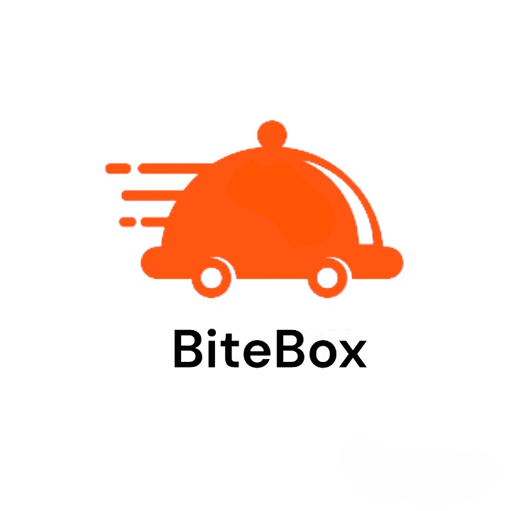

# BiteBox
<h1 align="center">BITEBOX</h1>
<p align="center">

</p>

<h3 align="center">A robust food ordering and delivery platform built using the toolset from the MERN stack.</h3>

<br />

<h2 align="center">🖥️ Tech Stack</h2>

<h4 align="center">Frontend:</h4>

<p align="center">
  
  
  
  
  
</p>

<h4 align="center">Backend:</h4>

<p align="center">
  
  
  

</p>

  </em>
</p>
<br />

## Table of Contents:

1) [Features](#fet)
2) [Getting Started](#install)
3) [Website Link](#projectLink)
4) [Tech-Stack Used](#depend) 
5) [APIs Used](#apis)
6) [Contributors](#contri)

<a name="fet"></a>
## Features

### 🚀 Essential Features

- Registration and Login: Google Auth0 Integration: Secure and seamless login and signup using Google Auth0.
- User Profile Form: Update your profile information in real-time, with pre-population of existing data.
- Restaurant Listings: Browse through a variety of restaurants and their menus.
- Menu Browsing: View menus and prices of various restaurants.
- Cart Management: Add, update, or remove items from your cart seamlessly. 
- Real-Time Order Tracking: Track the status of your order from preparation to delivery and remaining time based on current status.
- Estimated Delivery Time: Get accurate delivery time estimates for your orders.
- Cloudinary Integration: Seamless management and upload of images for restaurants.


<br />

### 🚀 Advanced Features

- Restaurant Profile Form: Manage restaurant details, upload multiple items, and images, with real-time updates.
- Advance Search: Find restaurants and dishes based on your location and city.
- Advanced Filtering and Sorting: Search and filter restaurants and dishes based on various criteria, including estimated delivery time, delivery price and cuisine.
- Order Summary: Review your cart with itemized details before proceeding to checkout.
- Order History: Access and review your past orders and their details.
- Delivery Address Customization: Add and manage delivery preferences.
- Responsive Design: Ensure a smooth user experience across all devices.
- Stripe Integration: Order foods securely using Stripe payment gateway and receive detailed information about the ordered items in the checkout session.
- Payments Page: A dedicated page for handling payments smoothly.

<br />

<a name="install"></a> 
## Getting Started

This project was built using React, Redux, Sass, HTML, JavaScript, Rest API, Node JS, Express and MongoDB with JWT and Stripe integration. It is an freelance outsourcing web application and for running on your local environment you should follow these guidelines.

1) Clone the repository using:
```bash
https://github.com/PaulSaurav19/BiteBox.git
```
2) Run the following in both the "client" and "server" folders:
```bash
npm install 
```
3) Start MongoDB and set up the following ENV files:

### Server
```
`MONGODB_CONNECTION_STRING`
e.g. mongodb cluster URI

`AUTH0_AUDIENCE`
e.g. "project-name-api"

`CLOUDINARY_CLOUD_NAME`
e.g. cloud name from the cloudinary dashboard

`CLOUDINARY_API_KEY`
e.g. api key from the cloudinary dashboard

`CLOUDINARY_API_SECRET`
e.g. secret key from the cloudinary dashboard

`FRONTEND_URL`
e.g. http://localhost:3000 or the production deployed client link

`STRIPE_API_KEY`
e.g. stripe secret key from the stripe dashboard

`STRIPE_WEBHOOK_SECRET`
e.g. webhook secret from the stripe dashboard

```
### Client
```
`VITE_API_BASE_URL`
e.g. http://localhost:7000 or production deployed server link

`VITE_AUTH0_DOMAIN`
e.g. `dev-examole.us.auth0.com`

`VITE_AUTH0_CLIENT_ID`
e.g. client ID from the auth0 dashboard

`VITE_AUTH0_CALLBACK_URL`
e.g  http://localhost:3000 or the production deployed client link

VITE_AUTH0_AUDIENCE
e.g. "project-name-api"

```
4) Run following in both "client" and "server" folders:
```bash
npm start
```

<a name="projectLink"></a> 
## Website Link

* [BiteBox](https://biteboxone.onrender.com)


<a name="depend"></a>
## Tech-Stack Used

* NodeJS
* ExpressJS
* React JS
* ShadCn UI
* Tailwind CSS
* Vite-JS Template
* JavaScript
* MongoDB (as Database)

<a name="apis"></a>
## APIs Used

* Stripe(to monitor payments)
* Postman
* Auth0

<a name="contri"></a>
## Contributors

* [Sourav Paul](https://github.com/PaulSaurav19)
* [Vishesh Agrawal](https://github.com/Vishesh-MNNIT)

## Feedback
Feel free to file an issue if you come across any bugs

### Made at:

<p align="center">

</p>
